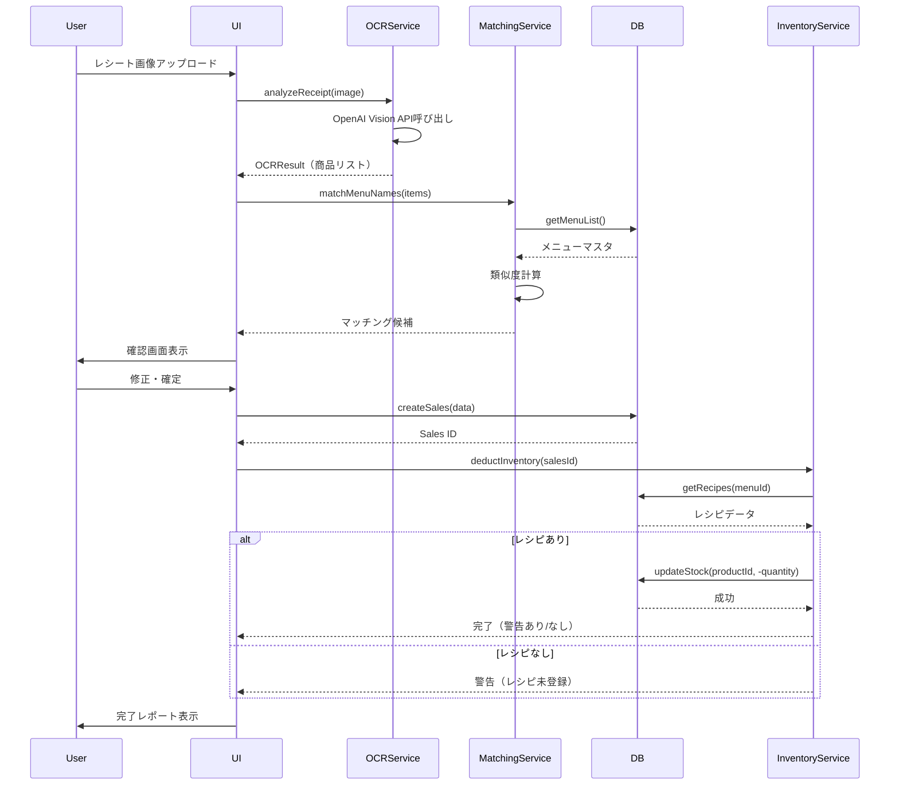

# 売上登録（OCR）処理フロー

## フロー全体図

```
[1] 画像アップロード
    ↓
[2] OCR解析（OpenAI Vision API）
    ↓
[3] メニュー名寄せ（自動マッチング）
    ↓
[4] 確認・修正画面（UI）
    ├─ マッチング成功 → 自動承認可能
    ├─ マッチング失敗 → 手動選択必要
    └─ 未登録メニュー → 新規登録促進
    ↓
[5] 売上データ保存
    ↓
[6] 在庫減算実行
    ├─ レシピあり → 自動減算
    ├─ レシピなし → スキップ＋警告
    └─ 在庫不足 → 許容＋警告表示
    ↓
[7] 完了通知＋レポート表示
```

## 詳細ステップ

### [1] 画像アップロード
**UI要素:**
- ドラッグ&ドロップエリア
- カメラ起動ボタン（モバイル対応）
- ファイル選択ボタン

**処理:**
```typescript
async function handleImageUpload(file: File) {
  // 1. 画像をBase64に変換
  const base64 = await fileToBase64(file);
  
  // 2. プレビュー表示
  setPreviewImage(base64);
  
  // 3. ローディング開始
  setIsAnalyzing(true);
  
  // 4. OCR解析開始
  const result = await ocrService.analyzeReceipt(base64);
  
  // 5. 次のステップへ
  proceedToMatching(result);
}
```

### [2] OCR解析
**技術選定: OpenAI GPT-4 Vision API**

**選定理由:**
1. ✅ 高精度な日本語認識（手書き・印字混在OK）
2. ✅ 構造化データ直接抽出（JSON形式）
3. ✅ 文脈理解（略語補完: ポテサラ→ポテトサラダ）
4. ✅ コスト効率（$0.01/画像 程度）
5. ✅ 簡単な実装（API 1回で完了）

**代替案:**
- Google Cloud Vision API: より詳細な座標・信頼度が必要な場合
- Azure Computer Vision: Microsoft環境との統合

**処理:**
```typescript
const ocrResult = {
  raw_text: "全文テキスト...",
  items: [
    {
      name: "ポテトサラダ",
      quantity: 2,
      unit_price: 500,
      subtotal: 1000,
      confidence: 0.95
    },
    {
      name: "ビール中",
      quantity: 1,
      unit_price: 600,
      subtotal: 600,
      confidence: 0.92
    }
  ],
  total_amount: 1600,
  receipt_date: "2025-12-12"
};
```

### [3] メニュー名寄せ（自動マッチング）
**名寄せアルゴリズム:**

```typescript
// 1. カタカナ正規化
"ポテサラ" → "ポテトサラダ"
"ハンバーグ" → "ハンバーグ"

// 2. レーベンシュタイン距離計算
similarity("ポテサラ", "ポテトサラダ") = 0.75
similarity("ビール中", "生ビール（中）") = 0.82

// 3. 候補選出（類似度60%以上）
candidates = [
  { menu: "ポテトサラダ", similarity: 0.75, suggested: false },
  { menu: "生ビール（中）", similarity: 0.82, suggested: true }
]
```

**マッチング戦略:**
- 類似度 80%以上 → 自動マッチング（確認推奨）
- 類似度 60-80% → 候補として提示
- 類似度 60%未満 → 未登録として扱う

**未登録メニュー検出時の処理:**
1. ユーザーに通知
2. 「新規メニュー追加」ボタン表示
3. レシピ登録を促す
4. 暫定的に売上のみ記録（在庫減算スキップ）

### [4] 確認・修正画面（UI設計）

**画面構成:**

```
┌─────────────────────────────────────────┐
│ レシート解析結果                          │
├─────────────────────────────────────────┤
│ [レシート画像プレビュー]                  │
│                                         │
│ 日付: 2025-12-12                        │
│ 合計金額: ¥1,600                        │
├─────────────────────────────────────────┤
│ 検出された商品:                          │
│                                         │
│ ✅ ポテトサラダ x2 ... ¥1,000           │
│    └ マッチ: メニュー「ポテトサラダ」    │
│    └ 類似度: 75%                        │
│    └ [変更] [削除]                      │
│                                         │
│ ⚠️ ビール中 x1 ... ¥600                 │
│    └ 候補1: 生ビール（中） (82%)        │
│    └ 候補2: 生ビール（小） (65%)        │
│    └ [選択] [新規登録]                  │
│                                         │
│ ❌ 本日のスープ x1 ... ¥300             │
│    └ 未登録メニューです                 │
│    └ [新規メニュー追加]                 │
├─────────────────────────────────────────┤
│ [キャンセル]  [手動編集]  [確定して保存]│
└─────────────────────────────────────────┘
```

**UI/UX提言:**

1. **視覚的フィードバック**
   - ✅ 緑: マッチング成功
   - ⚠️ 黄: 要確認
   - ❌ 赤: 未登録

2. **ワンクリック修正**
   - 候補をクリックで即座に変更
   - ドラッグ&ドロップで順序変更

3. **バッチ編集機能**
   - 全て承認ボタン
   - 未登録のみ後回しオプション

4. **学習機能（将来実装）**
   - ユーザーの修正パターンを学習
   - 次回から自動適用

### [5] 売上データ保存

```typescript
async function saveSalesData(confirmedData: OCRResult) {
  // 1. 売上ヘッダー作成
  const sales = await db.createSales({
    store_id: currentStore.id,
    sales_date: confirmedData.receipt_date,
    total_amount: confirmedData.total_amount,
    source: 'ocr',
    ocr_image_url: uploadedImageUrl,
    ocr_raw_text: confirmedData.raw_text,
    status: 'confirmed'
  });

  // 2. 売上明細作成
  for (const item of confirmedData.items) {
    await db.createSalesDetail({
      sales_id: sales.id,
      menu_id: item.matched_menu_id,
      menu_name_detected: item.name,
      quantity_sold: item.quantity,
      unit_price_at_sale: item.unit_price,
      subtotal: item.subtotal,
      confidence_score: item.confidence,
      is_matched: !!item.matched_menu_id,
      requires_review: !item.matched_menu_id
    });
  }

  return sales;
}
```

### [6] 在庫減算実行

**処理フロー:**
```typescript
async function executeInventoryDeduction(salesId: string) {
  const warnings = [];
  const results = [];

  // 売上明細を取得
  const details = await db.getSalesDetails(salesId);

  for (const detail of details) {
    if (!detail.menu_id) {
      // レシピ未登録
      warnings.push({
        type: 'no_recipe',
        message: `「${detail.menu_name_detected}」のレシピが未登録です`,
        action: 'レシピを登録してください'
      });
      continue;
    }

    // レシピ取得
    const recipes = await db.getRecipes(detail.menu_id);

    if (recipes.length === 0) {
      warnings.push({
        type: 'no_recipe',
        message: `メニュー「${detail.menu?.name}」のレシピが未登録です`,
        action: 'レシピを登録してください'
      });
      continue;
    }

    // 各材料の在庫減算
    for (const recipe of recipes) {
      const required = recipe.quantity_required * detail.quantity_sold;
      const current = await db.getCurrentStock(recipe.product_id);
      const newStock = current - required;

      // マイナス在庫を許容（警告のみ）
      if (newStock < 0) {
        warnings.push({
          type: 'negative_stock',
          message: `「${recipe.product.name}」の在庫が不足しています`,
          details: `現在: ${current}, 必要: ${required}, 不足: ${Math.abs(newStock)}`,
          action: '発注が必要です'
        });
      }

      // 在庫トランザクション記録
      await db.createInventoryTransaction({
        product_id: recipe.product_id,
        quantity: -required,
        type: 'sales',
        reference_id: detail.id,
        previous_quantity: current,
        new_quantity: newStock
      });

      // 在庫更新
      await db.updateProductStock(recipe.product_id, newStock);

      results.push({
        product: recipe.product.name,
        deducted: required,
        remaining: newStock
      });
    }
  }

  return { results, warnings };
}
```

### [7] 完了通知＋レポート表示

**完了画面:**
```
┌─────────────────────────────────────────┐
│ ✅ 売上登録が完了しました                │
├─────────────────────────────────────────┤
│ 登録内容:                                │
│ • 日付: 2025-12-12                      │
│ • 商品数: 3点                           │
│ • 合計金額: ¥1,600                      │
│                                         │
│ 在庫減算結果:                            │
│ ✅ じゃがいも: -400g (残り: 2.1kg)      │
│ ✅ マヨネーズ: -50ml (残り: 450ml)      │
│ ⚠️ ビール: -1本 (残り: -2本) ← 要発注! │
│                                         │
│ 警告:                                   │
│ ⚠️ 「本日のスープ」のレシピ未登録       │
│    → [今すぐ登録する]                   │
│                                         │
│ [レポートを見る]  [続けて登録]  [閉じる]│
└─────────────────────────────────────────┘
```

## エラーハンドリング仕様

### 1. 在庫マイナス許容
```typescript
// ❌ エラーにしない
if (newStock < 0) {
  // ✅ 警告のみ
  warnings.push({
    level: 'warning',
    type: 'negative_stock',
    product_id: productId,
    message: '在庫不足が発生しました',
    suggested_action: '発注を検討してください'
  });
  
  // ✅ 処理は続行
  await updateStock(productId, newStock); // マイナス値でも保存
}
```

**UI表示:**
- ダッシュボードに「要確認」バッジ
- 在庫画面で赤色表示
- 発注画面で自動提案

### 2. レシピ未登録時の挙動
```typescript
if (recipes.length === 0) {
  // ✅ 売上は記録
  await db.createSalesDetail({...});
  
  // ✅ 在庫減算はスキップ
  warnings.push({
    level: 'info',
    type: 'no_recipe',
    menu_id: menuId,
    message: 'レシピ未登録のため在庫減算をスキップしました',
    suggested_action: 'レシピを登録してください',
    action_url: `/menus/${menuId}/recipe`
  });
}
```

**UI表示:**
- メニュー画面に「レシピ未登録」バッジ
- ワンクリックでレシピ登録画面へ遷移

### 3. OCRマッチング失敗時
```typescript
if (matchCandidates.length === 0) {
  // ✅ 手動選択を促す
  return {
    status: 'requires_review',
    detected_name: itemName,
    suggestions: [],
    actions: [
      { label: '既存メニューから選択', action: 'select_from_list' },
      { label: '新規メニュー登録', action: 'create_new_menu' },
      { label: 'スキップ', action: 'skip_item' }
    ]
  };
}
```

## データフロー図（Mermaid）



## 推奨実装順序

1. **Phase 1: データベース構築**
   - スキーマ作成
   - サンプルデータ投入

2. **Phase 2: OCR基盤**
   - OpenAI Vision API統合
   - 画像アップロード機能

3. **Phase 3: 名寄せロジック**
   - 文字列類似度計算
   - マッチング候補表示

4. **Phase 4: UI実装**
   - 確認・修正画面
   - エラー表示・警告表示

5. **Phase 5: 在庫連動**
   - レシピ参照
   - 自動減算ロジック

6. **Phase 6: エラーハンドリング強化**
   - マイナス在庫対応
   - 未登録メニュー対応
